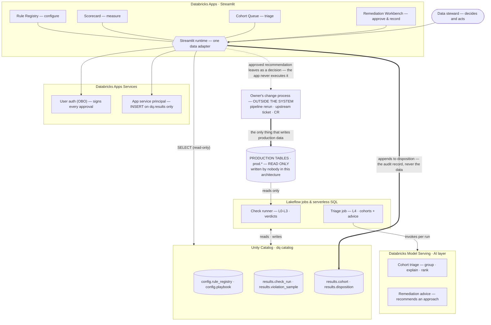

# DQ Triage Agent — architecture diagram source

Companion to `dq-triage-agent-spec.md`.
Surfaces: Scorecard, Cohort Queue, Remediation Workbench, Rule Registry Studio.

## The one claim this diagram makes

**Nothing in this system writes to business data.** The app's only write is the disposition
record — what was found, what was advised, what the owner decided, and whether it held.
Production tables sit outside the boundary: read by the check runner, written by nobody here.

That single constraint removes the audit problem, the rollback problem, and the "can this touch
billing data" conversation — and it means regulated tables need no special case.

## The approval chain

Five events, each a **new immutable row** in `dq.results.disposition`. Nothing is ever updated in
place, so the sequence itself is the evidence and a correction is a new row, not an edit.

| # | Event | Produced by | Carries |
|---|---|---|---|
| 01 | `recommended` | Triage job | Cohort, root-cause hypothesis, recommended approach |
| 02 | `reviewed` | Steward, in-app | accepted · deferred · rejected · no_action, plus a reason |
| 03 | `approved` | Approver(s), in-app | One row per approver. **P1 needs two distinct named approvers**; P2/P3 one |
| 04 | `executed` | Data owner, **outside the system** | Self-reported: what was done, when, ticket or job-run ref |
| 05 | `verified` | Next scheduled check run | Pass closes the cohort; fail appends a reopen and the chain continues |

Steps 01, 02, 03 and 05 are produced inside the system. **Step 04 is a claim the owner makes — the
register records it, it does not witness it.** No re-check job, nothing for the app to trigger, no
elevated permissions anywhere.

## Identity and permissions — two identities, deliberately

- **On-behalf-of-user authorization** establishes *who is acting*: the signed-in user's token is
  forwarded to the app (`x-forwarded-access-token`), so approver identity comes from the platform and
  cannot be typed into a form field.
- **The app's own service principal** performs the write, granted `INSERT` on `dq.results` and
  nothing else — no grant on any `prod.*` table.

A workspace admin can therefore demonstrate from Unity Catalog grants alone that the app cannot
modify business data. The guarantee is a permission, not a code review. Under OBO the app is also
confined to its declared OAuth scopes, so a steward who can write to production in a notebook still
cannot do it through this app.

**What this control is, and is not.** It records that named people approved and that someone
reported executing. It cannot prevent execution without approval, or prove what ran matched what was
approved. That makes it a **detective** control, not a preventive one. If it ever covers
SOX-relevant data, prevention has to live in change management and production grants — not here.

## Table model

| Table | Written by | Purpose |
|---|---|---|
| `dq.config.rule_registry` | Stewards (via app, shadow→active only) | What we check |
| `dq.config.playbook` | Stewards | Remediation **approaches** as reference material — non-executable by design |
| `dq.results.check_run` | Check runner | Every verdict, one row per rule per run |
| `dq.results.violation_sample` | Check runner | ≤100 example bad rows per breach |
| `dq.results.cohort` | Triage job | Grouped breaches + root-cause hypothesis + recommendation |
| `dq.results.disposition` | The app (service principal, `INSERT` only) | **The audit register** — append-only event log: recommended → reviewed → approved → executed → verified, each row carrying the acting identity from OBO |

## Per-surface access

| Surface | Reads | Writes |
|---|---|---|
| Rule Registry Studio | `rule_registry`, `check_run` | `rule_registry` (shadow → active only) |
| Scorecard | `check_run`, `cohort`, `disposition`, `rule_registry` | none |
| Cohort Queue | `cohort`, `violation_sample` | none |
| Remediation Workbench | `cohort`, `playbook`, `violation_sample` | `disposition` |

## The AI layer

Two Model Serving endpoints, **both invoked by the triage job on a schedule** — never by the app at
request time. The app only reads what they wrote.

| Endpoint | What it does | Priority |
|---|---|---|
| Cohort triage | Collapses many breaches from one root cause into one cohort; root-cause hypothesis, blast radius, ranking | Required — the queue is unusable without it |
| Remediation advice | Recommends an approach; drafts one where the playbook has no entry | Can follow one release later |

Boundary, unchanged from the parent architecture doc: sees aggregated results and ≤100-row samples,
never computes pass/fail, never writes data, never auto-approves. Every output is advice a human
accepts or rejects, stored with its input payload for audit.

## Phase placement

With execution out of scope this is **not a new layer** — it is L4 deepened. It belongs in **Phase 2**
of the parent doc's rollout rather than a Phase 4, does not wait on Phase 3 shift-left, and costs two
new tables, one extended job and one app.
